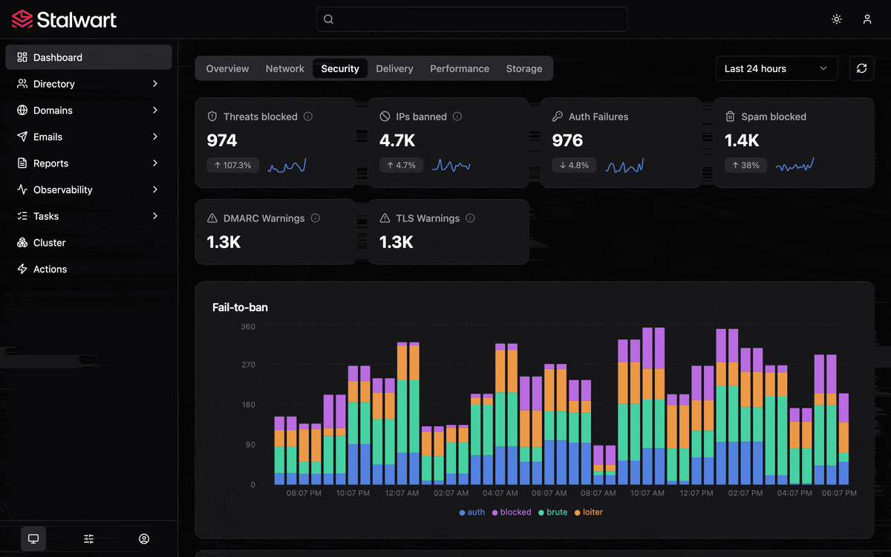

<p align="center">
    <a href="https://stalw.art">
    
    </a>
</p>

<h3 align="center">
  Secure, scalable mail & collaboration server with comprehensive protocol support 🛡️ <br/>(IMAP, JMAP, SMTP, CalDAV, CardDAV, WebDAV)
</h3>

<br>

<p align="center">
  <a href="https://www.gnu.org/licenses/agpl-3.0"></a>
  &nbsp;
  <a href="https://stalw.art/docs/install/get-started"></a>
</p>

---

> **⚠️ Private Fork — Enterprise Edition Unlocked**
>
> 本仓库是 [Stalwart](https://github.com/stalwartlabs/stalwart) 的私有 Fork，基于 `v0.16.8`，已解锁企业版功能。
> **仅限个人使用，不分发。**
>
> 原项目文档：[stalw.art/docs](https://stalw.art/docs/install/get-started)

## Features

**Stalwart** is an open-source mail & collaboration server with JMAP, IMAP4, POP3, SMTP, CalDAV, CardDAV and WebDAV support and a wide range of modern features. It is written in Rust and designed to be secure, fast, robust and scalable.

Key features:

- **Email** server with complete protocol support:
  - JMAP: 
    * [JMAP for Mail](https://datatracker.ietf.org/doc/html/rfc8621) server.
    * [JMAP for Sieve Scripts](https://www.ietf.org/archive/id/draft-ietf-jmap-sieve-22.html).
    * [WebSocket](https://datatracker.ietf.org/doc/html/rfc8887), [Blob Management](https://www.rfc-editor.org/rfc/rfc9404.html) and [Quotas](https://www.rfc-editor.org/rfc/rfc9425.html) extensions.
  - IMAP:
    * [IMAP4rev2](https://datatracker.ietf.org/doc/html/rfc9051) and [IMAP4rev1](https://datatracker.ietf.org/doc/html/rfc3501) server.
    * [ManageSieve](https://datatracker.ietf.org/doc/html/rfc5804) server.
    * Numerous [extensions](https://stalw.art/docs/development/rfcs#imap4-and-extensions) supported.
  - POP3:
    - [POP3](https://datatracker.ietf.org/doc/html/rfc1939) server.
    - [STLS](https://datatracker.ietf.org/doc/html/rfc2595) and [SASL](https://datatracker.ietf.org/doc/html/rfc5034) support as well as other [extensions](https://datatracker.ietf.org/doc/html/rfc2449).
  - SMTP:
    * SMTP server with built-in [DMARC](https://datatracker.ietf.org/doc/html/rfc7489), [DKIM](https://datatracker.ietf.org/doc/html/rfc6376), [SPF](https://datatracker.ietf.org/doc/html/rfc7208) and [ARC](https://datatracker.ietf.org/doc/html/rfc8617) support for message authentication.
    * Strong transport security through [DANE](https://datatracker.ietf.org/doc/html/rfc6698), [MTA-STS](https://datatracker.ietf.org/doc/html/rfc8461) and [SMTP TLS](https://datatracker.ietf.org/doc/html/rfc8460) reporting.
    * Automated DKIM key rotation and management.
    * Inbound throttling and filtering with granular configuration rules, sieve scripting, MTA hooks and milter integration.
    * Distributed virtual queues with delayed delivery, priority delivery, quotas, routing rules and throttling support.
    * Envelope rewriting and message modification.
- **Collaboration** server:
  - Calendaring and scheduling:
    - [CalDAV](https://datatracker.ietf.org/doc/html/rfc4791) and [CalDAV Scheduling](https://datatracker.ietf.org/doc/html/rfc6638) support.
    - [JMAP for Calendars](https://datatracker.ietf.org/doc/html/draft-ietf-jmap-calendars-24) support.
  - Contact management:
    - [CardDAV](https://datatracker.ietf.org/doc/html/rfc6352) support.
    - [JMAP for Contacts](https://datatracker.ietf.org/doc/html/rfc9610) support.
  - File storage:
    - [WebDAV](https://datatracker.ietf.org/doc/html/rfc4918) support.
    - [JMAP for File Storage](https://datatracker.ietf.org/doc/html/draft-ietf-jmap-filenode-03) support.
  - Sharing with fine-grained access controls:
    - [WebDAV ACL](https://datatracker.ietf.org/doc/html/rfc3744) support.
    - [JMAP Sharing](https://datatracker.ietf.org/doc/html/rfc9670) support.
- **Spam** and **Phishing** built-in filter:
  - Comprehensive set of filtering **rules** on par with popular solutions.
  - LLM-driven spam filtering and message analysis.
  - Statistical **spam classifier** with collaborative filtering, automatic training capabilities and address book integration.
  - DNS Blocklists (**DNSBLs**) checking of IP addresses, domains, and hashes.
  - Collaborative digest-based spam filtering with **Pyzor**.
  - **Phishing** protection against homographic URL attacks, sender spoofing and other techniques.
  - Trusted **reply** tracking to recognize and prioritize genuine e-mail replies.
  - Sender **reputation** monitoring by IP address, ASN, domain and email address.
  - **Greylisting** to temporarily defer unknown senders.
  - **Spam traps** to set up decoy email addresses that catch and analyze spam.
- **Flexible**:
  - Pluggable storage backends with **RocksDB**, **FoundationDB**, **PostgreSQL**, **mySQL**, **SQLite**, **S3-Compatible**, **Azure** and **Redis** support.
  - Full-text search available in 17 languages using the built-in search engine or via **Meilisearch**, **ElasticSearch**, **OpenSearch**, **PostgreSQL** or **mySQL** backends.
  - Sieve scripting language with support for all [registered extensions](https://www.iana.org/assignments/sieve-extensions/sieve-extensions.xhtml).
  - Email aliases, mailing lists, subaddressing and catch-all addresses support.
  - Automated DNS management.
  - Automatic account configuration and discovery with [autoconfig](https://www.ietf.org/id/draft-bucksch-autoconfig-02.html) and [autodiscover](https://learn.microsoft.com/en-us/exchange/architecture/client-access/autodiscover?view=exchserver-2019). 
  - Multi-tenancy support with domain and tenant isolation.
  - Disk quotas per user and tenant.
- **Secure and robust**:
  - Encryption at rest with **S/MIME** or **OpenPGP**.
  - Automatic TLS certificate provisioning with [ACME](https://datatracker.ietf.org/doc/html/rfc8555) using `TLS-ALPN-01`, `DNS-01`, `DNS-PERSIST-01` or `HTTP-01` challenges.
  - Automated blocking of IP addresses that attack, abuse or scan the server for exploits.
  - Rate limiting.
  - Security audited (read the [report](https://stalw.art/blog/security-audit)).
  - Memory safe (thanks to Rust).
- **Scalable and fault-tolerant**:
  - Designed to handle growth seamlessly, from small setups to large-scale deployments of thousands of nodes.
  - Built with **fault tolerance** and **high availability** in mind, recovers from hardware or software failures with minimal operational impact. 
  - Peer-to-peer cluster coordination or with **Kafka**, **Redpanda**, **NATS** or **Redis**.
  - **Kubernetes**, **Apache Mesos** and **Docker Swarm** support for automated scaling and container orchestration.
  - Read replicas, sharded blob storage and in-memory data stores for high performance and low latency.
- **Authentication and Authorization**:
  - **OpenID Connect** authentication.
  - OAuth 2.0 authorization with [authorization code](https://www.rfc-editor.org/rfc/rfc8628) and [device authorization](https://www.rfc-editor.org/rfc/rfc8628) flows.
  - **LDAP**, **OIDC**, **SQL** or built-in authentication backend support.
  - Two-factor authentication with Time-based One-Time Passwords (`2FA-TOTP`) 
  - Application passwords (App Passwords).
  - Roles and permissions.
  - Access Control Lists (ACLs).
- **Observability**:
  - Logging and tracing with **OpenTelemetry**, journald, log files and console support.
  - Metrics with **OpenTelemetry** and **Prometheus** integration.
  - Webhooks for event-driven automation.
  - Alerts with email and webhook notifications.
  - Live tracing and metrics.
- **Web-based administration**:
  - Dashboard with real-time statistics and monitoring.
  - Account, domain, group and mailing list management.
  - SMTP queue management for messages and outbound DMARC and TLS reports.
  - Report visualization interface for received DMARC, TLS-RPT and Failure (ARF) reports.
  - Configuration of every aspect of the mail server.
  - Log viewer with search and filtering capabilities.
  - Self-service portal for password reset and encryption-at-rest key management.

## Screenshots



## Get Started

### Docker 部署（推荐）

```bash
# 拉取镜像（需先登录 GHCR）
echo $CR_PAT | docker login ghcr.io -u YOUR_USERNAME --password-stdin
docker pull ghcr.io/preca-hoshino/stalwart:v0.16.8-patch-1

# 启动服务
docker compose up -d
```

### 二进制部署

从 [GitHub Releases](https://github.com/preca-hoshino/stalwart/releases) 下载对应平台的二进制包。

### 原项目文档

完整文档请参考：[stalw.art/docs](https://stalw.art/docs/install/get-started)

## 更新与升级

```bash
# 同步上游更新
gh repo sync preca-hoshino/stalwart -b v0.16.8-patch-1 --source stalwartlabs/stalwart

# Actions 自动重编译后，拉取新镜像
docker compose pull && docker compose up -d
```

## Support

本 Fork 为个人使用，不提供官方支持。

如有问题，请前往原项目 [Support Portal](https://support.stalw.art) 或 [GitHub Issues](https://github.com/stalwartlabs/stalwart/issues)。

## License

本项目基于 [GNU Affero General Public License v3.0](./LICENSES/AGPL-3.0-only.txt)。

原项目同时提供 [Stalwart Enterprise License v1 (SELv1)](./LICENSES/LicenseRef-SEL.txt) 用于商业用途。

> **注意**：本 Fork 仅限个人使用，不分发。如需商业使用请联系 [Stalwart Labs](https://stalw.art/enterprise)。

## Credits

- 原项目：[Stalwart Labs LLC](https://github.com/stalwartlabs/stalwart)
- 基于版本：`v0.16.8`

## Copyright

Copyright (C) 2020, Stalwart Labs LLC (原项目)